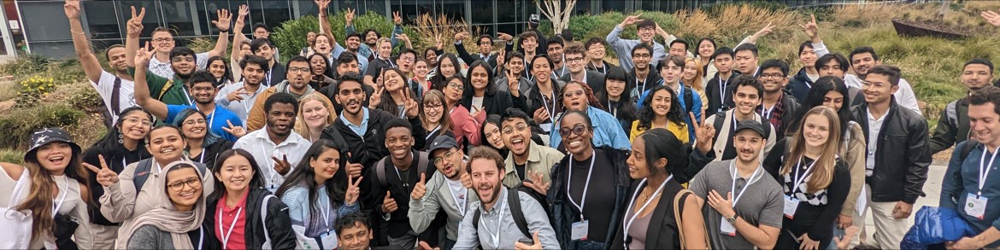

Hey there 👋

I am a computer science graduate with over three years of experience in software development. I have a strong skill set in C/C++, Python, JavaScript, and front-end and back-end technologies. My expertise extends to machine learning, AR/VR technologies, software testing, and automation. My work history includes experiences as a software developer intern, research assistant, machine learning intern, and software engineer at Adobe. I have earned an MS in Computer Science and have been recognized for my achievements through various awards and scholarships. I am deeply passionate about technology and am eager to continue expanding my skills.

Want to know more about me? [Check out my portfolio.](https://udayy.me/)

## 📌 Pinned Repositories

 

 

 

 

 

## &#x1f4c8; GitHub Stats

 

 
 

## 💼 Skills

More Skills

 

 

 

